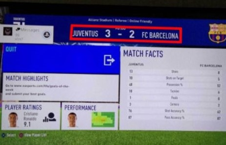
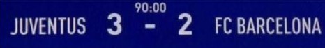

# Game score extraction

[](https://github.com/Solvve/ml_game_score_extraction/blob/master/LICENSE)
[](https://www.python.org/downloads/release/python-378/)
[](https://www.tensorflow.org/versions/r1.15/api_docs/python/tf)
[](https://solvve.com/)

## Description

This application allows extract [FIFA](https://www.ea.com/games/fifa) game score from photo or screenshot.

Score extraction is based on searching region of interest and text recognition from the region:

</img>

</img>


```
{
  "score":  "JUVENTUS 3 - 2 FC BARCELONA",
  "team1":  "JUVENTUS",
  "score1": "3",
  "score2": "2",
  "team2":  "FC BARCELONA"
}
```

## Installation

To use the application you need pretrained weights and language data for Tesseract-OCR - please, contact [ML team](mailto:ml@solvve.com) for more details.

 - Clone the repository:
 ```
 git clone https://github.com/Solvve/score_extractor_app.git
 ```
 - Install [Tesseract-OCR](https://github.com/tesseract-ocr/tesseract/wiki) >= 4.1.
 - Put **fifa_score.traineddata** file to %TESSDATA_PREFIX%.
 - Put **fifa_scores.h5** file to %PROJECT_PATH%/data
 - Install all required dependencies:
```
pip install -r requirements.txt
```

## Usage

```
python main.py
```

Application starts at http://localhost:8050/
